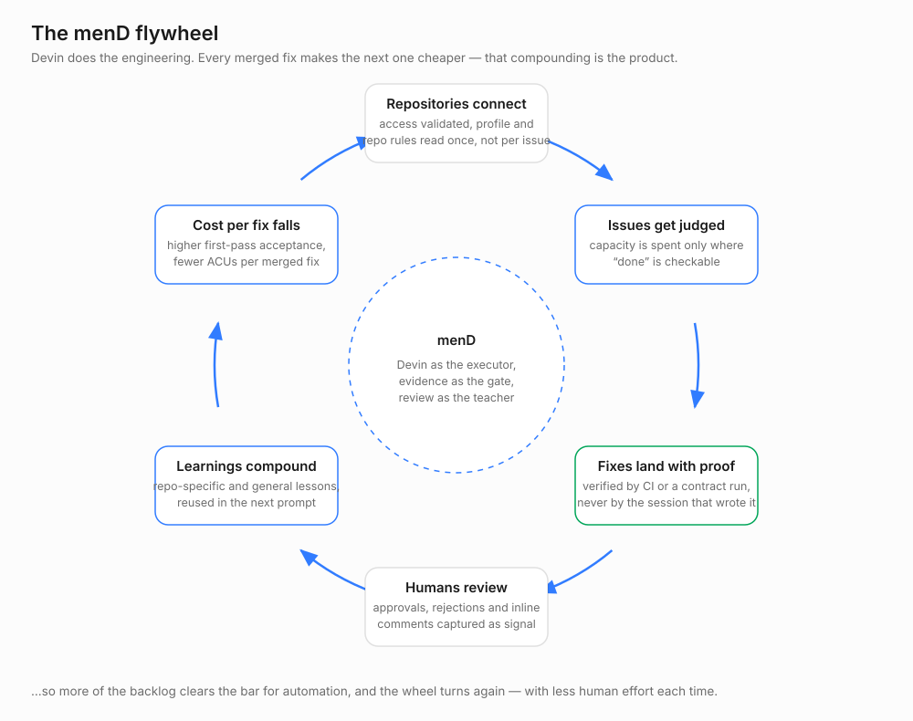
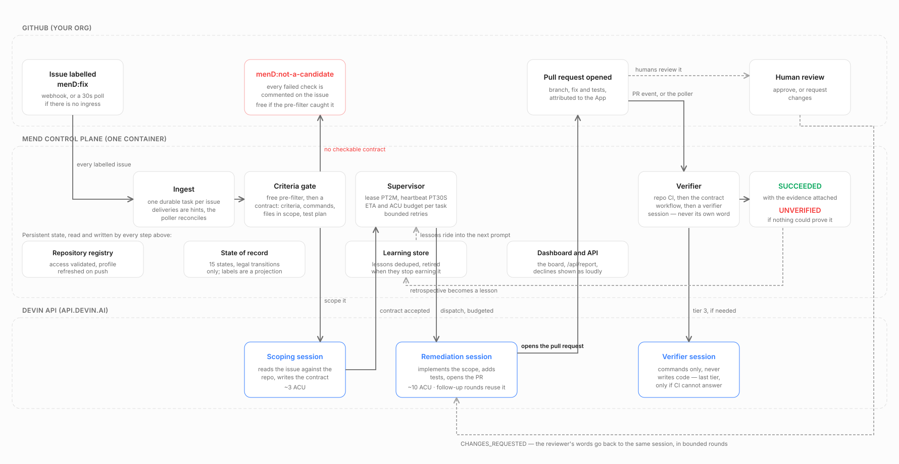

# menD

**Your backlog has hundreds of small, real, well-understood issues nobody will ever get to. menD closes them
— with evidence, or not at all.**

menD is an event-driven control plane that turns a GitHub label into a verified pull request. It watches the
repositories you register, refuses to spend anything on issues that have no machine-checkable definition of
done, dispatches one Devin session per issue that survives that gate, supervises it to a pull request, waits
for *independent* proof that the fix works, responds when a human reviewer pushes back, and learns from that
review so the next issue goes better.

Devin is the engineer. menD is everything a team needs around an engineer to trust the output: candidacy,
budgets, leases, retries, verification, review response, and an audit trail.

## The business case

A mid-size platform team carries 200–500 issues that are individually worth ~1–4 engineer-hours and
collectively worth nobody's quarter: dependency advisories, lint debt, error-handling gaps, flaky
config. They are never prioritised, and they are exactly the class of work an agent can finish.

menD's claim is narrow on purpose: *for issues with a machine-checkable definition of done, the cost of a fix
drops to a few ACUs and zero engineer-hours, and the risk stays bounded because nothing is called done
without independent evidence.* The dashboard reports the three numbers a VP asks for — success rate of
attempted issues, median time from label to pull request, and ACU per successful remediation — plus the
honest one: how much work menD **declined** because it could not be verified.

## Why it compounds



The first fix is the expensive one. Every turn of the loop makes the next turn cheaper: the repository profile
is already built, the criteria gate has learned which issues in this repo are actually finishable, and the
lessons from the last reviewer are already in the prompt. Cheaper fixes mean more of the backlog clears the
bar for automation, which produces more reviewed pull requests, which produces more lessons. The
uncomfortable half is just as important — work that cannot be proved lands in `UNVERIFIED`, so trust is
earned by the evidence rather than by the volume.

## How it works



```
GitHub issue labelled menD:fix
        │  webhook  ·  or 30s poller (no ingress required)
        ▼
   Orchestrator ── deterministic pre-filter (free) ────────────► NOT_A_CANDIDATE
        │                                                        (labelled + explained on the issue)
        ├─ criteria in the issue body?  ──► gate
        └─ otherwise read-only Devin scoping session ──► gate ──► NOT_A_CANDIDATE
                                                          │
                                                        READY
                                                          ▼
                             Devin remediation session (criteria + repo profile + lessons in the prompt)
                                                          ▼
                                    PR_OPEN ──► VERIFYING ──┬──► SUCCEEDED     (independent evidence)
                                                            ├──► UNVERIFIED    (nothing could prove it)
                                                            └──► CHANGES_REQUESTED
                                                                      │  reviewer feedback → same session
                                                                      └──► NEEDS_HUMAN after N rounds
                                                          ▼
                                          retrospective ──► learning store ──► next issue's prompt
```

## The candidate gate

An automation that opens a pull request for every issue is a liability. Before any remediation session is
created, an issue must have a non-placeholder body, no denylisted label, bounded file scope, at least one
acceptance criterion, at least one verification command, a stated test plan, no blocking unknowns, and
confidence ≥ 0.7.

Criteria come from a fenced block a human wrote in the issue:

````markdown
```devin-criteria
{
  "is_candidate": true,
  "confidence": 0.9,
  "problem_restatement": "...",
  "acceptance_criteria": ["..."],
  "verification_commands": ["..."],
  "test_plan": "which test proves this, new or existing",
  "files_in_scope": ["..."],
  "risk": "low",
  "blocking_unknowns": [],
  "rationale": "..."
}
```
````

or, when absent, from a short read-only Devin *scoping* session with a tight ACU cap that returns the same
schema as structured output. If the gate fails, the issue moves to `NOT_A_CANDIDATE`, is labelled
`menD:not-a-candidate`, and is commented on with the exact reasons and what a human would need to add.
Adding that detail and re-applying `menD:fix` re-enters the pipeline, so the gate teaches the team how to
write automatable issues instead of silently dropping them.

The accepted criteria become the contract: embedded in the remediation prompt, asserted point by point in the
session's structured output, and checked independently before anything is called done.

## Tests are part of the contract

A behavioural change without a test is not a finished change. The scoping session must state which test
proves the fix, and the remediation session must report `tests_changed` with the test evidence. "No test
change" is an outcome it has to *justify* (a lockfile pin, a docs-only edit), not one it can skip past — the
justification is surfaced on the PR and the task page.

## Verification: three tiers, and an honest fourth

`SUCCEEDED` requires evidence from something other than the session that wrote the code.

| Tier | What it is | When it applies |
|---|---|---|
| `REPO_CI` | the repository's own required checks on the PR head | preferred — it already knows the toolchain |
| `CONTRACT_WORKFLOW` | `menD / contract`, a workflow the repo merges once (`deploy/target-repo/mend-verify.yml`), dispatched by menD with that task's verification commands | repos with thin or missing CI |
| `VERIFIER_SESSION` | a separate command-only Devin session at the PR head that runs the commands and reports exit codes, never writing code | last resort; recorded as lower trust |
| `NONE` → `UNVERIFIED` | no independent evidence exists | the PR stays open and honest; it is **not** counted as a success |

The evidence — tier, verdict, commands, exit codes, output, check URL — is persisted on the task, posted as a
comment on the pull request, and shown on the task page.

menD deliberately does **not** run arbitrary repository test suites inside its own container: one image
cannot hold every toolchain, and it would be a rich arbitrary-code-execution target. Verification runs in the
repository's own CI environment or in a separately scoped session.

## The human review loop

Reviewers are the strongest signal menD gets, so rejection is a first-class state rather than a dead end.

- `pull_request_review`, `pull_request_review_comment` and closed-unmerged `pull_request` events (or the
  polling fallback) are read back from GitHub; deliveries are treated as hints, so a lost or duplicated
  webhook changes nothing.
- menD's own comments are filtered out — the loop cannot feed itself.
- `CHANGES_REQUESTED` sends the review body and inline comments to the **existing** Devin session, which
  still has the full context of the change it wrote. The prompt is explicit that the reviewer outranks the
  acceptance criteria where the two conflict.
- Rounds are bounded (`mend.learning.max-review-rounds`). Past that, or when a point needs a decision only a
  human can make, the task escalates to `NEEDS_HUMAN`. A pull request closed without merging is a failure
  signal, never a success.

## The learning store

After a terminal outcome with review feedback, a read-only retrospective session turns what happened into
durable lessons, each one phrased as an instruction, carrying its evidence, provenance (repo, issue, PR) and
a confidence — split into:

- **Repository lessons** — "run `npm audit` from `superset-frontend`, not the repo root". Injected into that
  repository's scoping and remediation prompts.
- **General lessons** — "always show the resolved-version diff when a lockfile changes". Injected everywhere,
  and candidates for promotion beyond menD.

Lessons are deduplicated by normalised text and scope, sorted by confidence, and capped so prompts cannot
grow without bound. Each one tracks how often it was applied and how often reviewers pushed back anyway; a
lesson that keeps failing to earn its place is retired automatically and kept for the audit trail.

Because some lessons are not menD's to act on, each carries a **recommended action**, surfaced at
`/learnings` for a human to approve:

| Action | Meaning |
|---|---|
| `PROMPT_PREAMBLE` | menD applies it itself, immediately |
| `DEVIN_KNOWLEDGE` | promote to an org-wide Devin knowledge note, so *every* session benefits — not just menD's |
| `REPO_INSTRUCTIONS` | belongs in the repo's own `AGENTS.md` / `CLAUDE.md` / `CONTRIBUTING.md` |
| `MEND_BACKLOG` | the lesson is about menD's own gate or prompts; file it against menD |
| `RETIRE` | stop applying it |

That is the closed loop: reviewers teach menD, menD teaches Devin, and the correction outlives the issue that
produced it.

## Multi-repository registry

Repositories are registered at `/repositories/new` (step-by-step instructions included). On registration menD
validates that its GitHub App installation can actually see the repository, then builds a **repository
profile** in a read-only Devin session: build and test commands, layout, CI, conventions, and — importantly —
whatever instruction files the repo already keeps for agents (`AGENTS.md`, `CLAUDE.md`, `codex.md`,
`CONTRIBUTING.md`, `.cursor/rules`, `.agents/skills`).

The profile is persisted and reused for every issue in that repository instead of re-read each time. Push
events age it incrementally, and it is refreshed only when the changed paths warrant it.

## State, leases and crash recovery

The database is menD's system of record; GitHub labels are a human-visible projection of it, never the source
of truth. Two tables: `remediation_task` (one durable row per issue, unique on `(repo, issue_number)`) and
`task_event` (append-only audit of every transition). `IssueState.canTransitionTo` is the single authority on
what may happen next, and `TaskService` is the only writer.

Workers coordinate through the database, so menD scales past one replica without two workers driving the same
issue:

- **Claim** — a conditional `UPDATE ... WHERE owner_id IS NULL OR lease_expires_at <= now`. In a race exactly
  one worker updates a row; the rest get zero and move on.
- **Predicted completion** — the claim writes `eta_at`, what the owner commits to for the state it is in.
  Past it, the task shows as overdue on the board; nothing silently sits forever.
- **Heartbeat** — leases are extended every 30s while work is in flight.
- **Death** — a dead worker stops heartbeating; after expiry any other stateless worker claims the task,
  increments `lease_takeovers`, and resumes from the persisted row. The Devin session id is already stored,
  so it keeps supervising the same session rather than starting a new one.
- **Release** — terminal states and clean shutdowns release immediately, so a rolling restart hands work over
  rather than waiting for expiry.

## Run it on a laptop

One container, one file-backed H2 database, `udaysagarn/superset` pre-registered.

```bash
cp .env.example .env       # fill in the Devin and GitHub App values
docker compose up -d --build
open http://localhost:8080
```

A Mac walkthrough of all three modes — read-only, simulated and live — is in [docs/DEMO-MAC.md](docs/DEMO-MAC.md),
and the issues the live demo runs against, with how each one was vetted, are in
[docs/DEMO-ISSUES.md](docs/DEMO-ISSUES.md).

Or `./deploy/demo.sh`, which does the above and prints the demo path. With no `.env` it starts in read-only
mode (`MEND_ENGINE_ENABLED=false MEND_POLLING_ENABLED=false`) so you can browse the whole product without
credentials, without touching GitHub, and without spending an ACU.

State lives in the `mend-data` volume, so `docker compose down` and back up keeps your history. If Maven
Central rate-limits the build (shared and cloud IPs get HTTP 429 regularly), the image retries through a
read-only mirror of Central by itself; behind a corporate proxy, force yours with
`--build-arg MAVEN_MIRROR_URL=https://your/mirror`.

### Secrets

| Variable | What it is |
|---|---|
| `DEVIN_API_KEY` | Devin **service-user** key (`cog_…`), not a personal one |
| `DEVIN_ORG_ID` | organisation the service user belongs to; scopes every v3 session route |
| `GITHUB_APP_ID`, `GITHUB_APP_INSTALLATION_ID`, `GITHUB_APP_PRIVATE_KEY` | the GitHub App menD acts as |
| `GITHUB_WEBHOOK_SECRET` | HMAC-SHA256 secret for `/webhooks/github` |
| `MEND_REPO` | the default repository, seeded into the registry on first boot |
| `MEND_REPOS` | additional repositories to seed, comma-separated |

menD acts as a GitHub App rather than as a person: it signs an RS256 JWT with the app's private key, exchanges
it for a one-hour installation token, and refreshes before expiry. Every label, comment and PR is attributable
to the bot identity in the audit log, and permissions (Issues: write, Pull requests: write, Contents / Checks
/ Metadata: read) are scoped to the installed repositories. Both PKCS#1 and PKCS#8 keys are accepted.
`GITHUB_TOKEN=ghp_…` remains a fallback for local development. No secret is ever written to the repository or
to the database. Creating all of these from scratch, with the exact permissions and a pre-flight check, is
[docs/CREDENTIALS.md](docs/CREDENTIALS.md).

### Local development

```bash
mvn spring-boot:run          # needs the same environment variables
mvn -B verify                # the full suite, with a coverage floor
```

Before you change anything, read [AGENTS.md](AGENTS.md): how we work, the mental models behind the
control plane, the sharp edges (Flyway-owned schema, enum column mapping, the review watermark), what
is deliberately unbuilt, and the open ToDos.

The state store is plain JPA: point `MEND_DB_URL` at PostgreSQL for a multi-replica deployment; nothing else
changes.

### Simulate the whole workflow locally (no credentials, no ACUs)

A contributor should be able to change the orchestrator and watch the consequences without a GitHub App, a
Devin key, or a network. The `sandbox` Spring profile swaps two beans — the GitHub client and the Devin
client — for in-memory simulations. Everything else is the production code path: the same pre-filter,
candidacy gate, state machine, leases, verification tiers, review loop and learning store.

```bash
./deploy/simulate.sh         # docker compose up in sandbox mode, then files one issue per scenario
```

or, without Docker:

```bash
SPRING_PROFILES_ACTIVE=sandbox mvn spring-boot:run
curl -X POST localhost:8080/api/sandbox/issues/all
```

Four issues are filed, each written to exercise one path, and the set settles in about a minute on
`/pipeline`:

| Scenario | What it proves | Path |
|---|---|---|
| `CLEAN_FIX` | the happy path, proved by the repository's own CI | `DISCOVERED → READY → RUNNING → PR_OPEN → VERIFYING → SUCCEEDED` |
| `NOT_A_CANDIDATE` | the gate declines work no test could settle, before spending a session | `DISCOVERED → NOT_A_CANDIDATE` |
| `UNVERIFIED` | a pull request nothing can prove is not called a success | `… → VERIFYING → UNVERIFIED` |
| `REVIEW_THEN_FIX` | a reviewer rejects it, the same session answers, the lesson is kept | `… → PR_OPEN → CHANGES_REQUESTED → RUNNING → SUCCEEDED` |

The sandbox is also a control surface, so you can play the human parts yourself:

```bash
curl localhost:8080/api/sandbox                       # every label, comment, PR and review menD wrote
curl -X POST 'localhost:8080/api/sandbox/issues?scenario=UNVERIFIED'
curl -X POST localhost:8080/api/sandbox/pulls/9001/request-changes \
     -H 'content-type: application/json' -d '{"reviewer":"you","body":"add a test next to the component"}'
```

The loops tick every five seconds under this profile instead of every thirty, so a run is watchable. What the
sandbox does *not* prove is the two things only the real services can: that GitHub's API contract still holds,
and that Devin can actually write the fix. Those need credentials and a real repository.

## What you see

| Route | Purpose |
|---|---|
| `/` | product overview, registered repositories, architecture diagram |
| `/pipeline` | the live board: KPIs, pipeline, run table, exclusions, transition stream |
| `/tasks/{id}` | one issue end to end: criteria contract, sessions, verification evidence, lease, audit |
| `/learnings` | what reviewers have taught menD, and what needs a human to promote |
| `/repositories/new` | step-by-step registration |
| `/deck` | the twelve-slide walkthrough, drawn from this instance's own numbers — arrow keys, printable |
| `/api/report` | markdown report for a leadership audience |
| `/api/summary`, `/api/tasks`, `/api/learnings`, `/api/repositories` | JSON read model |
| `/actuator/prometheus` | `mend_issues{state}`, `mend_sessions_active`, `mend_time_to_pr`, `mend_transitions`, `mend_acu_budget` |
| `/webhooks/github` | issues, push, review and pull-request events (HMAC verified) |
| `/api/sandbox` | simulated GitHub, `sandbox` profile only — file issues, play the reviewer, read the world |

The stylesheet uses Devin's own design tokens under its `.light` / `.dark` / `.high-contrast` scheme, so the
view is recognisably part of the product rather than an approximation of it.

## Demo path

1. `/` — what it does, which repositories are connected.
2. `/repositories/new` — register one; menD validates access and profiles the codebase.
3. Label a real issue `menD:fix`. Watch `/pipeline`: criteria → session → PR → verification.
4. Label a placeholder issue too — it comes back `menD:not-a-candidate` with reasons, having spent nothing.
5. Reject one of menD's PRs with "changes requested". Watch it come back as `CHANGES_REQUESTED`, answer the
   reviewer in the same session, and land a lesson in `/learnings`.
6. `/api/report` — the leadership view.

## Limits, honestly

- Verification is only as strong as the repository's CI. Where none exists and the contract workflow is not
  merged, menD reports `UNVERIFIED` rather than inflating its own numbers.
- The contract workflow (`deploy/target-repo/mend-verify.yml`) is a starter template: a repository with an
  unusual toolchain should adapt the setup steps before merging it.
- Every page and every `/api` route is unauthenticated; only `/webhooks/github` verifies anything, and
  only that the payload came from GitHub. Fine on a laptop or a private network, not beyond it.
- Lesson effectiveness is tracked per repository, not per individual injected lesson — good enough to retire
  bad advice, not yet a precise attribution.
- General lessons are surfaced for human promotion rather than written straight into org-wide Devin knowledge;
  that approval step is deliberate.

## Next: lessons become playbooks

Today a lesson ends up in a prompt menD assembles per session and then throws away. The next step is to make
that procedure a first-class artefact — a Devin playbook the humans own and menD merely invokes.

- **Two playbooks per repository**, not one per org: a remediation playbook (how a fix lands here) and a
  verification playbook (what proof this repository accepts). Conventions differ per codebase, so scope
  follows the codebase.
- **Human approval, always.** menD proposes a playbook diff with the review comment that motivated it; a
  human accepts, edits or rejects. A rejected proposal is not offered again.
- **Versioned, and recorded per task.** Every task stores which playbook revision it ran under, so "did
  review comments drop after v3?" is a question the data can answer — and a revision that makes things worse
  can be rolled back.
- **Humans own the artefact.** A hand edit is authoritative; menD reads it and stops proposing that change.

The split that decides where a lesson goes: a *fact* about the repository belongs in knowledge or its
instruction file; a *procedure* belongs in a playbook.
