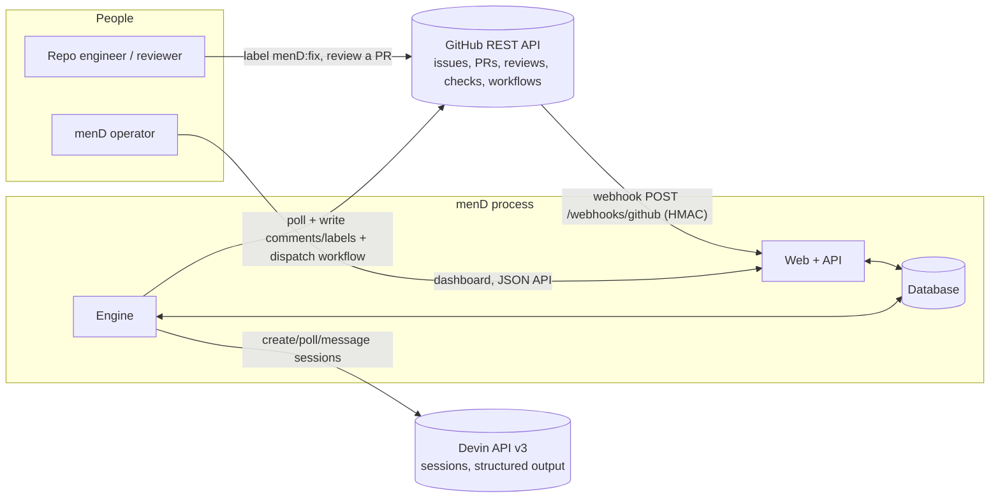
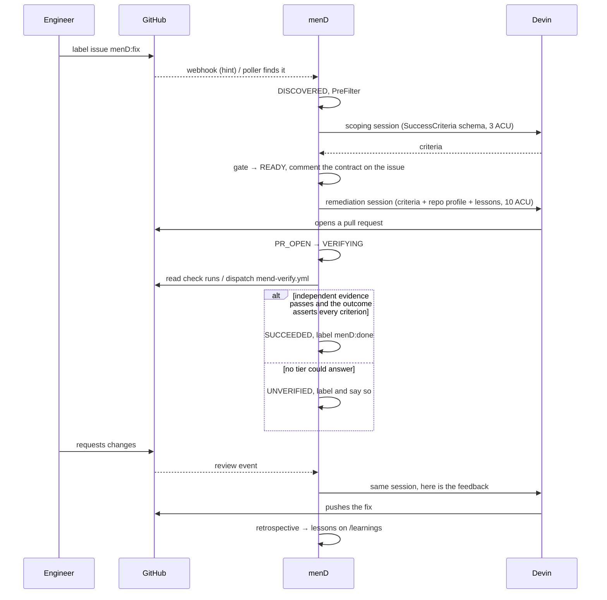

# menD — logical architecture

Written from the code in `src/main/java/ai/devin/mend`, the templates, the migrations and
`application.yml`. Every component below exists; nothing here is aspirational. Route-level detail lives
in [SITEMAP.md](SITEMAP.md), request/response shapes in the [wiki](wiki/), the working agreement in
[AGENTS.md](../AGENTS.md).

- [1. What the system is](#1-what-the-system-is)
- [2. Context: the three edges](#2-context-the-three-edges)
- [3. Runtime shape](#3-runtime-shape)
- [4. Component catalogue](#4-component-catalogue)
- [5. Contracts](#5-contracts)
- [6. Control flow](#6-control-flow)
- [7. Invariants](#7-invariants)
- [8. Extension points](#8-extension-points)
- [9. Trust boundaries and current gaps](#9-trust-boundaries-and-current-gaps)

---

## 1. What the system is

A single Spring Boot process (Java 21, Maven, Thymeleaf + htmx, no frontend build) that turns a GitHub
label into a *verified* pull request. Devin does the engineering; menD is the control plane around it:
candidacy gating, budgets, leases, retries, independent verification, review response, learning and an
audit trail.

Three properties determine the whole design:

| Property | Consequence in the code |
|---|---|
| The database is the system of record | GitHub labels are a projection written by `Notifier`, never read back as state. Every decision is a row in `remediation_task` + `task_event`. |
| Events are hints, state is reconciled | `WebhookController` never trusts payload contents for state; it re-reads GitHub. `Reconciler` and `IssuePoller` reach the same outcome with no ingress at all. |
| Evidence outranks assertion | The session that wrote the code cannot certify it. `Verifier` produces `SUCCEEDED` only from an independent tier; otherwise `UNVERIFIED`, which is a first-class terminal state. |

---

## 2. Context: the three edges



Only three integrations exist: **GitHub REST**, **Devin API v3**, and the **HTTP surface** menD itself
serves. There is no message broker, no cache, no object store; the database carries all durable state
and all cross-worker coordination.

---

## 3. Runtime shape

```mermaid
flowchart TB
  subgraph ingest
    WH[WebhookController] --- IP[IssuePoller<br/>@Scheduled 30s]
  end
  subgraph engine
    RC[Reconciler<br/>@Scheduled 15s] --> LM[LeaseManager]
    RC --> OR[Orchestrator]
    OR --> TS[TaskService<br/>only writer]
    OR --> PF[PreFilter] & SC[SuccessCriteriaService] & PB[PromptBuilder] & VF[Verifier] & NT[Notifier]
  end
  subgraph learning
    RL[ReviewLoop<br/>@Scheduled 2m] --> LS[LearningService]
  end
  subgraph registry
    RS[RepositoryService] --- CS[ContextService] --- CR[ContextReconciler]
  end
  subgraph clients
    GC[GitHubClient + GitHubCredentials]
    DC[DevinApiClient]
  end
  subgraph web
    DB1[DashboardController] --- AC[ApiController] --- RP[ReportService]
  end
  WH & IP --> OR
  OR --> GC & DC
  RL --> GC & DC & TS
  CS --> DC
  TS --> DBS[(remediation_task, task_event,<br/>repository, repository_context, learning)]
  MM[MendMetrics] -.-> DBS
```

Three schedulers drive everything: `Reconciler.tick` (15 s) advances tasks, `IssuePoller.poll` (30 s)
discovers labelled issues, `ReviewLoop.tick` (2 min) reads human reviews. Each is level-triggered — it
recomputes from persisted state — so a restart, a lost webhook or a duplicate delivery costs latency,
never correctness. Horizontal scale is safe because work is claimed through database leases.

---

## 4. Component catalogue

Per component: purpose, what it exposes to the rest of the system (its integration point) and the
contract that holds at that point.

### 4.1 Domain and state (`domain`)

| Component | Purpose | Integration point | Contract |
|---|---|---|---|
| `IssueState` | The state machine, and the only authority on legality | `canTransitionTo(next)`, `isTerminal()` | 15 states (`DISCOVERED`, `CRITERIA_PENDING`, `READY`, `DISPATCHED`, `RUNNING`, `BLOCKED`, `PR_OPEN`, `VERIFYING`, `CHANGES_REQUESTED`, `SUCCEEDED`, `UNVERIFIED`, `FAILED`, `NOT_A_CANDIDATE`, `NEEDS_HUMAN`, `CANCELLED`); the transition table below is normative. Terminal: `SUCCEEDED`, `UNVERIFIED`, `FAILED`, `NOT_A_CANDIDATE`, `NEEDS_HUMAN`, `CANCELLED` — `FAILED` is terminal *for the attempt* and re-dispatchable while budget remains |
| `RemediationTask` | The aggregate: one issue under remediation | JPA entity, unique `(repo, issue_number)` | Carries criteria JSON + hash, session ids/urls (criteria, remediation, verifier, retrospective), PR url, verification tier + JSON, outcome JSON, feedback JSON, attempts, nudges, review rounds, ACU budget, lease owner/expiry |
| `TaskEvent` | Append-only audit of every transition | Written only by `TaskService` | `(task, from, to, reason, actor, at)`; never updated or deleted |
| `SuccessCriteria` | The machine-checkable definition of done | `JSON_SCHEMA` for Devin, snake_case JSON for storage | See [5.2](#52-devin-structured-output) |
| `RemediationOutcome` | What a remediation session claims it did | `JSON_SCHEMA`, `allCriteriaSatisfied()` | A claim only; never sufficient for `SUCCEEDED` |
| `Verification` | The verdict and where it came from | `tier`, `result`, evidence | `PASSED` / `FAILED` / `UNAVAILABLE` × `REPO_CI` / `CONTRACT_WORKFLOW` / `VERIFIER_SESSION` |
| `Retrospective` | What one remediation should teach the next | `JSON_SCHEMA` | Lessons with `scope`, `topic`, `lesson`, `evidence`, `recommended_action`, `confidence` |
| `ContextKind` | The nine slices of a repository profile | `invalidatedBy(path)` | Path triggers per slice (`pom.xml` → `STACK`, `.github/workflows/` → `CI`, `agents.md` → `AGENT_RULES`, …); a push refreshes only the slices it touches |
| `Learning` | A durable lesson with attribution and lifecycle | JPA entity | Scope `REPO`/`GENERAL`, dedup key, applications, retired flag |

### 4.2 Engine (`engine`)

| Component | Purpose | Integration point | Contract |
|---|---|---|---|
| `Orchestrator` | Drives one task through one step of its lifecycle | `onTriggerLabel(repo, issue)` → creates or returns the task in `DISCOVERED`; `advance(task)` → performs exactly the step its current state calls for | Idempotent per call: re-invoking with the same issue never creates a second task (unique `(repo, issueNumber)`); `advance` on a terminal state is a no-op. Never mutates state directly — always via `TaskService` |
| `TaskService` | **The only writer of task state** | `transition(task, next, reason, actor)` (`@Transactional`) | Rejects illegal transitions via `IssueState.canTransitionTo`; writes the `TaskEvent`; records `MendMetrics`; clears lease ownership when `next.isTerminal()` |
| `Reconciler` | The level-triggered loop that reclaims and advances work | `@Scheduled(mend.engine.reconcile-interval, default PT15S)` | Claims active tasks and retryable `FAILED` tasks up to `mend.engine.max-concurrent-sessions`; a task another worker holds is skipped, not stolen, until its lease expires |
| `LeaseManager` | Cooperative ownership across workers | `claimable(states)`, `claim`, `renew`, `release`, `heartbeat`, `estimatedRemaining(state)` | Claim is an atomic conditional update on `(owner_id, lease_expires_at)`; a lease lasts `mend.engine.lease-duration` (PT2M) and is renewed every `heartbeat-interval` (PT30S); an expired lease is takeable, so a crashed worker cannot strand a task |
| `Verifier` | Independent evidence for a pull request | `verify(task, criteria, pullNumber)` → `Verification` | Tier precedence in [5.4](#54-verification); never runs target-repo commands inside the menD container |
| `PromptBuilder` | Assembles every prompt sent to Devin | `scopingPrompt`, `remediationPrompt`, `verifierPrompt`, `retrospectivePrompt`, `reviewFeedbackMessage`, `stallNudge`, `ciFailureNudge` | Injects issue body, criteria, repository profile (`ContextService`) and lessons (`LearningService`); pairs each prompt with the structured-output schema its caller will parse |
| `Notifier` | Makes every decision visible on the issue | `ensureLabels`, `criteriaAccepted`, `notACandidate`, `dispatched`, `prOpened`, `verification`, `succeeded`, `unverified`, `changesRequested`, `learned`, `failed`, `escalated` | Comments carry a fixed footer; `settleLabel` removes stale lifecycle labels before applying a terminal one, so an issue never holds two outcome labels |

### 4.3 Triage (`triage`)

| Component | Purpose | Integration point | Contract |
|---|---|---|---|
| `PreFilter` | Free, deterministic rejection before any ACU is spent | `reject(title, body, labels)` → `Optional<reason>` | Rejects on too-short body, missing title, denied labels, placeholder text, unfilled templates. Runs before every scoping session |
| `SuccessCriteriaService` | Owns the criteria contract | `embeddedCriteria(issueBody)`, `parseStructuredOutput(node)`, `gate(criteria)` → violations, `toJson`/`fromJson`, `hash(criteria)` | `gate` requires candidacy, acceptance criteria, verification commands and files in scope; empty violations means dispatchable. `hash` is stable and stamped on the session tag, tying a dispatch to the exact contract it was given |

### 4.4 External clients (`devin`, `github`)

| Component | Purpose | Integration point | Contract |
|---|---|---|---|
| `DevinApiClient` | Session create / poll / message | `createSession(prompt, title, tags, maxAcuLimit, structuredOutputSchema, repo)`, `getSession(id)`, `sendMessage(id, text)` | `POST/GET /v3/organizations/{org}/sessions[/{id}[/messages]]`, bearer auth; retries 429/5xx/resource-access up to 3 times with exponential backoff; every call counted in `mend.api.calls` |
| `DevinDtos.SessionDetails` | The polled session view | `isBlocked()`, `isFinished()`, `isExpired()`, `hasStructuredOutput()`, `pullRequestUrl()` | `waiting_for_user`/`suspended` → blocked; `exit`/`finished` → finished; `error` → expired; structured output must be non-empty JSON to count |
| `GitHubClient` | Every GitHub read and write | `listIssuesWithLabel`, `getIssue`, `getRepo`, `installationRepos`, `installationPermissions`, `branchHeadSha`, `comment`, `addLabels`, `removeLabel`, `ensureLabel`, `getPullRequest`, `listReviews`, `listReviewComments`, `listPullRequestFiles`, `checkRuns`, `ciVerdict`, `dispatchWorkflow` | Owner and repo name are always separate path variables, never one encoded `owner/name`; failures are surfaced as empty/absent results rather than exceptions where a caller can proceed |
| `GitHubCredentials` | Authentication | App JWT → installation token, or PAT fallback | Refreshes the installation token before expiry; converts a PKCS#1 key into a PKCS#8 envelope so a raw `.pem` works; exposes installation identity and granted permissions for registry validation |

### 4.5 Ingest (`ingest`)

| Component | Purpose | Integration point | Contract |
|---|---|---|---|
| `WebhookController` | Low-latency hint intake | `POST /webhooks/github` | Verifies `X-Hub-Signature-256` (HMAC-SHA256, constant-time compare) before parsing; dispatches on `X-GitHub-Event` ∈ {`issues`, `push`, `pull_request`, `pull_request_review`, `pull_request_review_comment`}; ignores unknown events and unregistered/non-operational repositories; always 200s on an ignored delivery |
| `IssuePoller` | Ingestion with no ingress at all | `@Scheduled(mend.github.poll-interval, PT30S)`; `ApplicationReadyEvent` → `ensureLabels` | Lists open issues carrying the trigger label per operational repository; each repository is polled independently so one unreachable repo cannot stop the rest; disabled by `mend.github.polling-enabled=false` or missing credentials |

### 4.6 Registry and context (`registry`)

| Component | Purpose | Integration point | Contract |
|---|---|---|---|
| `RepositoryService` | Which repositories menD may act on | `register(slug)`, `validate(repository)`, `all()`/`operational()`, `find(slug)`, `primary()`, `notePush(...)`, `triggerLabel(repository)` | Validation checks reachability and the installation's permissions; a failing repository is **stored with its failure**, not dropped, so the dashboard can explain why it is not operational. Only operational repositories are polled or accepted from webhooks |
| `ContextService` | A durable profile of each repository, so sessions don't re-read the codebase | `profileFor(slug)`/`renderProfile`, `slices(repository)`, `onPush(repository, commits, changedPaths, headSha)` | Profile generated by a read-only Devin session capped at 3 ACUs; stamped with the indexed commit SHA; a push marks only the slices its paths invalidate (`ContextKind`); stale slices are rendered as "may be out of date" rather than hidden |
| `ContextReconciler` | Regenerates stale slices out of band | `@Scheduled(mend.engine.context-interval, PT60S)` | Regenerates per slice, not per repository |
| `ContextPrompt` | The profile prompt text | Used by `ContextService` | One prompt per `ContextKind` |

### 4.7 Review and learning (`learning`)

| Component | Purpose | Integration point | Contract |
|---|---|---|---|
| `ReviewLoop` | Turns human review into action | `@Scheduled(mend.learning.review-poll-interval, PT2M)`; `onPullRequestEvent(repo, prUrl, closedUnmerged)` | Filters out bots (menD's own comments included) so the loop cannot feed itself; only reviews newer than the persisted watermark are acted on, compared at the database's timestamp precision; a rejection moves the task to `CHANGES_REQUESTED` and the feedback goes back to the **same** Devin session; a PR closed unmerged escalates to `NEEDS_HUMAN`; after a task settles it runs the retrospective session |
| `LearningService` | Lessons in, prompts out | `absorb(retrospective…)`, `lessonsFor(repo)`, `markApplied`, `recordFeedbackDespite`, `active`/`byScope`/`retired`, `recommendedActions` | Deduplicates on scope+topic+text; injects repo-scoped then general lessons into prompts; tracks applications and whether feedback recurred despite the lesson; retires lessons that stop paying; surfaces `RecommendedAction` for a human (promotion itself is deliberately not built — see AGENTS.md §6.2) |

### 4.8 Web (`web`) and metrics (`metrics`)

| Component | Purpose | Integration point | Contract |
|---|---|---|---|
| `DashboardController` | The operator UI | `/`, `/pipeline`, `/tasks/{id}`, `/learnings`, `/repositories/new`, `/deck`, `/fragments/live` | Server-rendered Thymeleaf; `/fragments/live` is the htmx polling fragment |
| `ApiController` | The JSON surface | `/api/summary`, `/api/states`, `/api/tasks[/{id}[/events]]`, `POST /api/tasks/{id}/cancel`, `POST /api/issues/{number}/ingest`, `/api/repositories`, `POST /api/repositories/{id}/validate`, `/api/learnings`, `/api/report` | Read models only, plus three commands; the commands go through `Orchestrator`/`TaskService`, never straight to the repository layer |
| `DashboardService` / `ReportService` | Read models and the report | Called by the two controllers | Counts declined and unverified work as prominently as successes |
| `MendErrorController` | Branded error page | `/error` | — |
| `MendMetrics` | Prometheus instrumentation | `/actuator/prometheus` | Gauges `mend.issues{state}`, `mend.sessions.active`; counters `mend.transitions{from,to}`, `mend.outcomes{outcome}`, `mend.acu.budget{kind}`, `mend.api.calls{api,operation,success}`; timers `mend.time.to.pr`, `mend.time.to.outcome` (p50/p90) |

### 4.9 Sandbox (`sandbox`, profile `sandbox`)

| Component | Purpose | Integration point | Contract |
|---|---|---|---|
| `SandboxGitHubClient` / `SandboxDevinClient` | Replace **exactly two beans** | Same interfaces as the real clients | No network, no credentials, no ACUs |
| `SandboxHub` | The simulated world | In-memory issues, PRs, reviews, checks | Deterministic; four scenarios: `CLEAN_FIX` → `SUCCEEDED`, `NOT_A_CANDIDATE`, `UNVERIFIED`, `REVIEW_THEN_FIX` → `CHANGES_REQUESTED` → `SUCCEEDED` + lessons |
| `SandboxController` | Drive the simulation | `GET /api/sandbox`, `POST /api/sandbox/issues?scenario=&repo=`, `POST /api/sandbox/issues/all`, `POST /api/sandbox/pulls/{n}/request-changes` | Present only under the profile |
| `SandboxPagesController` | Clickable simulated objects | `/sandbox/{owner}/{repo}/{issues\|pull}/{n}` | Simulated links must stay inside menD; minting `github.com` URLs would 404 mid-demo |

Everything between those two edges — pre-filter, gate, state machine, leases, verification, review
loop, learning, dashboard — is the production path, which is why the four scenarios run as a CI
regression test.

---

## 5. Contracts

### 5.1 State machine

```
DISCOVERED → CRITERIA_PENDING → READY → DISPATCHED → RUNNING ⇄ BLOCKED
                    ↓                                    ↓
             NOT_A_CANDIDATE                          PR_OPEN → VERIFYING → SUCCEEDED
                                                         ↑          ↓          UNVERIFIED
                                              CHANGES_REQUESTED ────┘          FAILED → (retry) DISPATCHED
                                                                                NEEDS_HUMAN / CANCELLED
```

| State | Who advances it | Action taken | Exits |
|---|---|---|---|
| `DISCOVERED` | `Orchestrator.triage` | Read issue, `PreFilter`, embedded criteria or scoping session | `CRITERIA_PENDING`, `READY`, `NOT_A_CANDIDATE` |
| `CRITERIA_PENDING` | poll scoping session | Parse structured output, `gate` | `READY`, `NOT_A_CANDIDATE`, `FAILED` |
| `READY` | dispatch | Create remediation session with criteria + context + lessons | `DISPATCHED` |
| `DISPATCHED`/`RUNNING`/`BLOCKED` | poll session | Nudge a stalled session, read outcome, detect PR | `RUNNING`, `BLOCKED`, `PR_OPEN`, `FAILED` |
| `PR_OPEN` | reconcile | Hand to verification | `VERIFYING` |
| `VERIFYING` | `Verifier` | Independent evidence | `SUCCEEDED`, `UNVERIFIED`, `FAILED` |
| `CHANGES_REQUESTED` | `ReviewLoop`/`Orchestrator` | Feedback back into the same session | `RUNNING` |
| `FAILED` | reconcile | Retry while `attempts < mend.engine.max-attempts` | `DISPATCHED`, else terminal |

`SUCCEEDED` requires **both** an independent `PASSED` verification *and* `RemediationOutcome.allCriteriaSatisfied()`.

### 5.2 Devin structured output

Four schemas, each Draft-7, each passed as `structuredOutputSchema` on session creation and parsed
strictly on poll (snake_case JSON ↔ Java records):

| Schema | Session | Required fields |
|---|---|---|
| `SuccessCriteria` | scoping (`mend.devin.criteria-acu-limit`, default 3) | `is_candidate`, `confidence`, `problem_restatement`, `acceptance_criteria[]`, `verification_commands[]`, `files_in_scope[]`, `test_plan`, `risk`, `blocking_unknowns[]`, `rationale` |
| `RemediationOutcome` | remediation (`mend.devin.remediation-acu-limit`, default 10) | `remediated`, `pr_url`, `summary`, `files_changed[]`, `criteria_results[]` (per criterion: satisfied + evidence), `tests_changed[]`, `test_evidence`, `commands_run[]`, `confidence`, `blocked_reason` |
| verifier report | verifier (command-only, never writes code) | pass/fail per verification command with output evidence |
| `Retrospective` | retrospective | `summary`, `lessons[]` with `scope` ∈ {`REPO`,`GENERAL`}, `topic`, `lesson`, `evidence`, `recommended_action` ∈ {`PROMPT_PREAMBLE`,`DEVIN_KNOWLEDGE`,`REPO_INSTRUCTIONS`,`MEND_BACKLOG`}, `confidence` |

Session tags are the reverse link: `["mend", <kind>, <repo>, "criteria:" + criteriaHash]`.

### 5.3 GitHub

- **Trigger**: label `mend.github.trigger-label` (default `menD:fix`) on an open issue.
- **Projection labels**, created idempotently at boot by `Notifier.ensureLabels`: in-progress,
  pr-open, done, not-a-candidate, needs-human, unverified, changes-requested. Written by menD, never
  read as input.
- **Webhook**: `POST /webhooks/github`, HMAC-SHA256 in `X-Hub-Signature-256` against
  `mend.github.webhook-secret`, event in `X-GitHub-Event`. Payloads are hints; state is re-read.
- **Embedded criteria**: an issue body may carry a fenced `devin-criteria` block matching the
  `SuccessCriteria` schema, which skips the scoping session entirely.
- **Contract workflow** (`deploy/target-repo/mend-verify.yml`, copied into the target repo):
  dispatched via `POST /repos/{owner}/{name}/actions/workflows/{file}/dispatches` with inputs
  `pull_request` and `commands` (newline-separated, from the agreed criteria), run on the PR head ref.
  The job name must keep the `menD` prefix — that is how `Verifier` distinguishes its own contract run
  from the repository's native checks, which always outrank it.
- **Permissions** required of the App installation are validated at registration and surfaced on the
  repository page rather than failing later at write time.

### 5.4 Verification

Precedence, first tier able to answer wins:

1. `REPO_CI` — the repository's own check runs on the PR head (legacy commit statuses considered too).
2. `CONTRACT_WORKFLOW` — the menD-prefixed check run from `mend-verify.yml`; dispatched if absent and
   dispatchable.
3. `VERIFIER_SESSION` — a fresh, command-only Devin session that runs the agreed verification commands
   and may not write code.
4. Nothing answered → `UNAVAILABLE` → the task settles as `UNVERIFIED`. Never as success.

### 5.5 HTTP surface

Full list with controllers in [SITEMAP.md](SITEMAP.md). Shape: HTML pages (`/`, `/pipeline`,
`/tasks/{id}`, `/learnings`, `/repositories/new`, `/deck`, `/fragments/live`), JSON under `/api/**`,
the webhook, sandbox routes under the profile, and `/actuator/{health,info,metrics,prometheus}`.

### 5.6 Persistence

Flyway owns the schema per dialect (`db/migration/h2`, `db/migration/postgresql`) with
`ddl-auto: validate`. Five tables: `remediation_task`, `task_event`, `repository`,
`repository_context`, `learning`. Enum columns are `varchar(32)` with **no** CHECK constraint —
adding a state must be a code change, never a schema change — and are mapped
`@Enumerated(STRING)` + `@JdbcTypeCode(SqlTypes.VARCHAR)`, guarded by `SchemaMigrationTest`.

### 5.7 Configuration

Everything is bound to `MendProperties` under `mend.*` from environment variables; see
`application.yml` and `.env.example`. The load-bearing ones: `DEVIN_API_KEY`, `DEVIN_ORG_ID`,
`GITHUB_APP_ID`/`GITHUB_APP_INSTALLATION_ID`/`GITHUB_APP_PRIVATE_KEY` (or `GITHUB_TOKEN`),
`GITHUB_WEBHOOK_SECRET`, `MEND_REPO`/`MEND_REPOS`, `MEND_TRIGGER_LABEL`, `MEND_ENGINE_ENABLED`,
`MEND_POLLING_ENABLED`, the ACU caps, and the interval/concurrency knobs
(`MEND_RECONCILE_INTERVAL`, `MEND_POLL_INTERVAL`, `MEND_MAX_CONCURRENT`, `MEND_MAX_ATTEMPTS`,
`MEND_LEASE_DURATION`, `MEND_HEARTBEAT_INTERVAL`). Missing Devin/GitHub credentials degrade to a
read-only dashboard rather than a crash.

---

## 6. Control flow

The happy path, end to end:



Failure handling: a session that stalls gets a bounded number of nudges; a session that errors or a
verification that fails moves to `FAILED` and is re-dispatched while `attempts < max-attempts`, then
stops; anything ambiguous escalates to `NEEDS_HUMAN` rather than guessing.

---

## 7. Invariants

1. `TaskService.transition` is the only code that writes task state. Anything else mutating a task is
   a bug.
2. No transition happens that `IssueState.canTransitionTo` rejects; every one that happens leaves a
   `TaskEvent`.
3. One task per `(repo, issueNumber)`, enforced in the schema, so replayed webhooks and the poller
   converge instead of duplicating.
4. A task is advanced only by the worker holding its lease; terminal states release ownership.
5. `SUCCEEDED` is unreachable without independent evidence.
6. menD never executes a target repository's commands inside its own container.
7. Sandbox links resolve inside menD.
8. Nothing menD writes to GitHub is ever read back as authoritative state.

---

## 8. Extension points

| To add… | Change |
|---|---|
| A verification tier | `Verifier` + `VerificationTier`; keep precedence explicit and `UNAVAILABLE` honest |
| A state | `IssueState` (value + transition table) and the `Orchestrator` branch; **no migration** — enum columns are plain varchar |
| A profile slice | `ContextKind` (label + path triggers) and a `ContextPrompt` entry |
| Another ingest source | Anything that can call `Orchestrator.onTriggerLabel` |
| A simulation scenario | `SandboxScenario` + `SandboxHub`, then the CI demo job asserts it |
| A new external backend | Swap the client bean the way the sandbox profile does |

---

## 9. Trust boundaries and current gaps

| Boundary | Control today |
|---|---|
| GitHub → menD (webhook) | HMAC-SHA256 verified, unregistered repositories ignored |
| menD → GitHub | Scoped App installation token, refreshed before expiry; permissions validated at registration |
| menD → Devin | Bearer key, per-session ACU caps, tags for attribution |
| Devin → target repo | Devin's own sandbox; menD never runs repo code |
| Operator → menD | **Nothing.** |

That last row is the single biggest gap: every page and every `/api` route — including
`POST /api/repositories`, `POST /api/tasks/{id}/cancel` and `POST /api/issues/{number}/ingest` — is
open to whoever reaches the port. menD belongs on a laptop or a private network until that is fixed.
Also open, from [AGENTS.md](../AGENTS.md) §7: lesson attribution is per repository rather than per
injected lesson; the contract workflow is a starter template a novel toolchain must adapt; lesson
promotion to playbooks/knowledge is specified but deliberately unbuilt.
